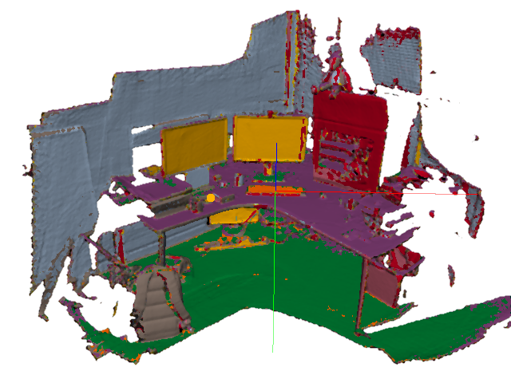

# SemanticPaint: A Framework for Interactive, Real-Time 3D Scene Segmentation



*Project page:* [http://www.semantic-paint.com](http://www.semantic-paint.com)

This is an open-source, real-time implementation of the interactive *SemanticPaint* system for geometric reconstruction, object-class segmentation and learning of 3D scenes, originally published in [Valentin15]. Using our system, a user can walk into a room wearing a depth camera and a virtual reality headset, and both densely reconstruct the 3D scene [Newcombe11,Niessner13,Kaehler15] and interactively segment the environment into object classes such as 'chair', 'floor' and 'table'. The user interacts *physically* with the real-world scene, touching objects and using voice commands to assign them appropriate labels. These user-generated labels are leveraged by an online random forest-based machine learning algorithm, which is used to predict labels for previously unseen parts of the scene. The entire pipeline runs in real time, and the user stays 'in the loop' throughout the process, receiving immediate feedback about the progress of the labelling and interacting with the scene as necessary to refine the predicted segmentation.

This version of the *SemanticPaint* concept was implemented by [Stuart Golodetz](http://research.gxstudios.net) and [Michael Sapienza](http://sites.google.com/site/mikesapi), under the supervision of [Professor Philip Torr](http://www.robots.ox.ac.uk/~tvg).

It is built on top of [InfiniTAM v3](http://www.robots.ox.ac.uk/~victor/infinitam/index.html), a highly efficient, open-source 3D reconstruction engine developed by Oxford's [Active Vision Group](http://www.robots.ox.ac.uk/OxVisionLib). Anyone interested in InfiniTAM should contact [Victor Adrian Prisacariu](mailto:victor@viprad.net).

The original concept for *SemanticPaint* was developed by a large number of people both at the University of Oxford and at Microsoft Research: Julien Valentin, Vibhav Vineet, Ming-Ming Cheng, David Kim, Shahram Izadi, Jamie Shotton, Pushmeet Kohli, Matthias Niessner, Antonio Criminisi and Philip H S Torr.

## Acknowledgements

We gratefully acknowledge the help of Julien Valentin, for his help in getting us up to speed with the project, of Victor Adrian Prisacariu and Olaf Kaehler, for implementing the 3D reconstruction engine on which our work is based, without which our work would not be possible, of Anurag Arnab, for his help with the saving and loading of scenes, and of Stephen Hicks and Joram van Rheede, for helping us to exhibit our work at SIGGRAPH 2015.

## Context

Scene understanding has many applications both within Computer Vision and beyond, but our primary motivation comes from a project led by [Stephen Hicks](http://www.ndcn.ox.ac.uk/team/stephen-hicks) to build augmented-reality glasses for the partially-sighted. Please read about it [here](http://www.va-st.com/smart-specs/).

## Publications

If you build on this framework for your research, please consider citing both our technical report that describes this implementation of the *SemanticPaint* concept, and the original research paper by Valentin *et al.*:
```
@techreport{Golodetz2015,
  author = {Stuart Golodetz* and Michael Sapienza* and Julien P C Valentin and Vibhav Vineet and Ming-Ming Cheng and Anurag Arnab and Victor A Prisacariu and Olaf K{\"a}hler and Carl Yuheng Ren and David W Murray and Shahram Izadi and Philip H S Torr},
  title = {{SemanticPaint: A Framework for the Interactive Segmentation of 3D Scenes}},
  institution = {Department of Engineering Science, University of Oxford},
  number = {TVG-2015-1},
  note = {Released as arXiv e-print 1510.03727},
  month = {October},
  year = {2015}
}
```

```
@article{Valentin2015,
  author = {Julien Valentin and Vibhav Vineet and Ming-Ming Cheng and David Kim and Jamie Shotton and Pushmeet Kohli and Matthias Niessner and Antonio Criminisi and Shahram Izadi and Philip H S Torr},
  title = {{SemanticPaint: Interactive 3D Labeling and Learning at your Fingertips}},
  journal = {ACM Transactions on Graphics},
  volume = {34},
  number = {5},
  year = {2015}
}
```

# Installation Guide

## 1. Building the System

### 1.1 Overview

SemanticPaint builds with CMake 3.8.2 and above on Windows, Ubuntu and Mac OS X.
It has been tested on recent versions of all three operating systems, but may
require additional work to build on older versions.

### 1.2 Dependencies

SemanticPaint depends on various 3rd party libraries. Some of these are
required, in the sense that SemanticPaint will not function without them;
others are optional, but skipping them will reduce functionality.

Suitable versions of the required dependencies and some of the optional
dependencies have been included in the repository, so SemanticPaint should
build "out of the box". However, most users will probably want to install
the remaining optional libraries in order to enable full functionality.

```
  - ArrayFire (version 3.3.2)
    Status: Optional (needed for touch interaction and median filtering)
    Default: Disabled
    Flag: WITH_ARRAYFIRE

  - Boost (version 1.56.0)
    Status: Required

  - CUDA (version 7.5)
    Status: Optional (needed for GPU acceleration)
    Default: Enabled
    Flag: WITH_CUDA

  - Eigen (version 3.2.2)
    Status: Required

  - GLEW (version 1.12.0)
    Status: Required on Windows/Ubuntu

  - InfiniTAM (version 3)
    Status: Required

  - Leap Motion SDK (version 2.2.1.24116)
    Status: Optional (needed for experimental Leap Motion support)
    Default: Disabled
    Flag: WITH_LEAP

  - Oculus SDK (version 0.5.0.1)
    Status: Optional (needed for Oculus Rift support)
    Default: Disabled
    Flag: WITH_OVR

  - OpenCV (version 3.1.0)
    Status: Optional (needed for feature inspection mode)
    Default: Disabled
    Flag: WITH_OPENCV

  - OpenGL
    Status: Required

  - OpenMP
    Status: Optional, but recommended (needed for faster training/prediction)
    Default: Disabled
    Flag: WITH_OPENMP
    Notes: Doesn't work on Mac OS X

  - OpenNI (version 2)
    Status: Optional, but recommended (needed for live reconstruction)
    Default: Disabled
    Flag: WITH_OPENNI

  - SDL (version 2-2.0.3)
    Status: Required

  - Vicon SDK
    Status: Optional (needed for the Vicon tracker)
    Default: Disabled
    Flag: WITH_VICON
```

### 1.3 Build Process

Common steps on all platforms:

  1. Choose a root directory, hereafter referred to as <root>.

  2. Clone the InfiniTAM repository into <root>/InfiniTAM.

  3. Build the spaint_v3 branch of InfiniTAM using CMake (using <root>/InfiniTAM/InfiniTAM/build as your build directory).

  4. Clone SemanticPaint into <root>/spaint, e.g.

     ```
     $ git clone git@github.com:torrvision/spaint.git spaint
     ```

  5. Change to the spaint directory:

     ```
     $ cd spaint
     ```

#### 1.3.1 Build Process (Windows)

  1. Using a Bash shell (e.g. Git Bash, provided with msysgit), run the top-level build script, e.g. for VS2013:

     ```
     $ ./build-win.sh 12 Release
     ```

  2. Run the CMake GUI and specify <root>/spaint/build as the build directory.

  3. Enable any optional libraries you want and supply the paths.

  4. Reconfigure and regenerate the Visual Studio solution.

  5. Build with the optional libraries enabled (just run the above build command again).

#### 1.3.2 Build Process (Unix)

  1. Run the top-level build script:

     ```
     $ ./build-nix.sh "Unix Makefiles" Release
     ```

  2. Change to the build directory and run ccmake:

     ```
     $ cd build
     ```

     ```
     $ ccmake ..
     ```

  3. Enable any optional libraries you want and supply the paths.

  4. Reconfigure and regenerate the makefile.

  5. Build with the optional libraries enabled, e.g.

     ```
     $ make -j4
     ```

## 2. Running the System

The build process will build various applications, libraries and test
programs in &lt;root&gt;/build. The main application can be found at:

```
<root>/build/bin/apps/spaintgui/spaintgui
```

It can be run "out of the box" from any working directory for live
reconstruction, provided you have built with OpenNI support.

If you want to reconstruct from data stored on disk (e.g. the Teddy
sequence that is used in InfiniTAM), you can pass the same parameters
that would normally be passed to InfiniTAM to spaintgui, e.g.:

```
$ ./spaintgui Teddy/calib.txt Teddy/Frames/%04i.ppm Teddy/Frames/%04i.pgm
```

The arguments specify a text file containing calibration parameters,
and masks for the RGB and depth images in the input sequence.

## 3. Troubleshooting Tips

If you have any trouble with the build, here are some of the likely causes:

* The CMake executable is not on your path.
* The MSBuild executable is not on your path. (Windows)
* The Visual C++ compiler (cl.exe) is not on your path. (Windows)
* The latest Visual Studio updates have not been installed. (Windows)

# Licence

SemanticPaint © 2015-2017, Torr Vision Group, The University of Oxford (the "Software")

The Software remains the property of the University of Oxford ("the University").

The Software is distributed "AS IS" under this Licence solely for non-commercial use in the hope that it will be useful, but in order that the University as a charitable foundation protects its assets for the benefit of its educational and research purposes, the University makes clear that no condition is made or to be implied, nor is any warranty given or to be implied, as to the accuracy of the Software, or that it will be suitable for any particular purpose or for use under any specific conditions. Furthermore, the University disclaims all responsibility for the use which is made of the Software. It further disclaims any liability for the outcomes arising from using the Software.

The Licensee agrees to indemnify the University and hold the University harmless from and against any and all claims, damages and liabilities asserted by third parties (including claims for negligence), which arise directly or indirectly from the use of the Software or the sale of any products based on the Software.

No part of the Software may be reproduced, modified, transmitted or transferred in any form or by any means, electronic or mechanical, without the express permission of the University. The permission of the University is not required if the said reproduction, modification, transmission or transference is done without financial return, the conditions of this Licence are imposed upon the receiver of the product, and all original and amended source code is included in any transmitted product. You may be held legally responsible for any copyright infringement that is caused or encouraged by your failure to abide by these terms and conditions.

You are not permitted under this Licence to use this Software commercially. Use for which any financial return is received shall be defined as commercial use, and includes:

1. integration of all or part of the source code or the Software into a product for sale or license by or on behalf of Licensee to third parties or 
2. use of the Software or any derivative of it for research with the final aim of developing software products for sale or license to a third party or 
3. use of the Software or any derivative of it for research with the final aim of developing non-software products for sale or license to a third party, or 
4. use of the Software to provide any service to an external organisation for which payment is received. 

If you are interested in using the Software commercially, please contact Torr Vision Group directly to negotiate a licence.

Contact details are: [philip.torr@eng.ox.ac.uk](mailto:philip.torr@eng.ox.ac.uk).

# History

* 2017-AUG-08: second public release
* 2015-SEP-26: first public release
* 2015-JUL-23: initial draft

# References

* [Kaehler15] Olaf Kaehler, Victor Adrian Prisacariu, Carl Yuheng Ren, Xin Sun, Philip Torr and David Murray. Very High Frame Rate Volumetric Integration of Depth Images on Mobile Devices. IEEE Transactions on Visualization and Computer Graphics, 21(11), November 2015.
* [Newcombe11] Richard Newcombe, Shahram Izadi, Otmar Hilliges, David Molyneaux, David Kim, Andrew Davison, Pushmeet Kohli, Jamie Shotton, Steve Hodges and Andrew Fitzgibbon. KinectFusion: Real-Time Dense Surface Mapping and Tracking. ISMAR, 2011.
* [Niessner13] Matthias Niessner, Michael Zollhoefer, Shahram Izadi, and Marc Stamminger. Real-time 3D Reconstruction at Scale using Voxel Hashing. ACM Transactions on Graphics, 32(6):169, 2013.
* [Valentin15] Julien Valentin, Vibhav Vineet, Ming-Ming Cheng, David Kim, Shahram Izadi, Jamie Shotton, Pushmeet Kohli, Matthias Niessner, Antonio Criminisi, and Philip H S Torr. SemanticPaint: Interactive 3D Labeling and Learning at your Fingertips. ACM Transactions on Graphics, 34(5), August 2015.
